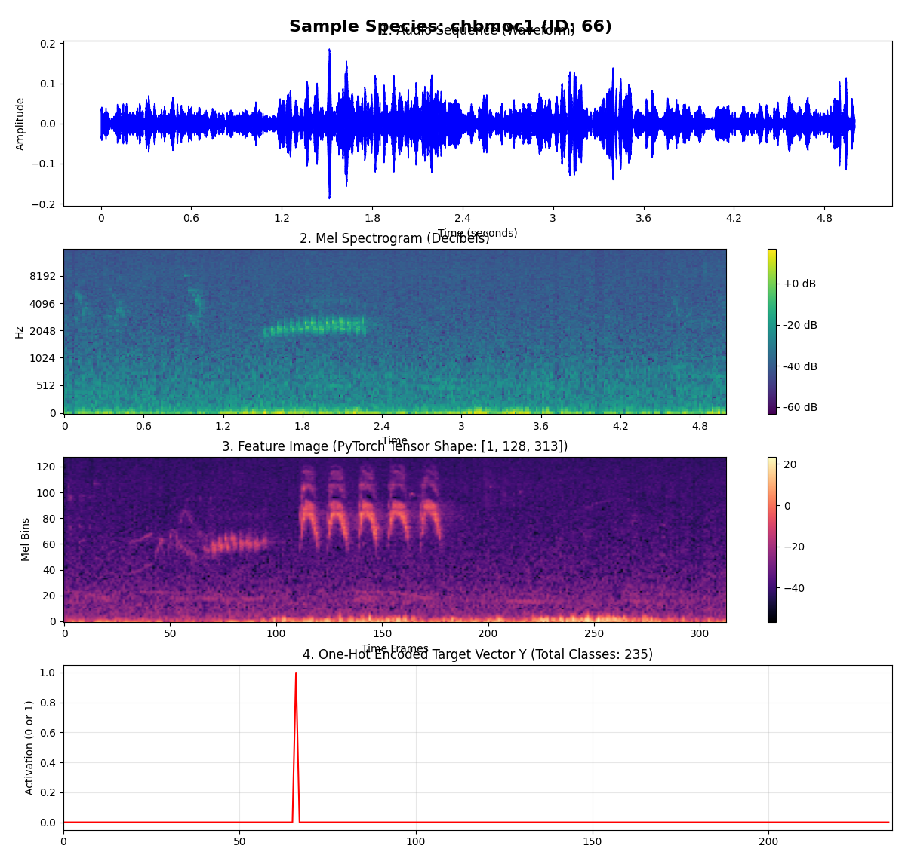

# BirdCLEF - Acoustic Species Identification in the Pantanal, South America

This project aims to predict 235 different birds and amphibious species from audio recordings recorded by different biology research groups.
We code and train from scratch, leveraging state-of-the art AI techniques such as Model Stacking/Blending, usage of priors (bayesian probab.) as well as audio augmentation pipelines.


## 1. Architecture 🤖
First step is to convert the **audio clip** to a MEL **spectrogram** using `librosa.feature.melspectrogram`.

In order to obtain the **features** (3rd image) we do use a simple image encoder `efficientnet_b0` implemented by the `timm` library, using pre-trained weights for the most part of the training. Finally, the features pass through an **attention** layer + **classifier**, which predict the animal **class label**. 

Lastly, a 2-layer Attention pooling block implemented by `torch.nn` will map the feature image to the corresponding class. Its selection mechanism allows to ignore silence and focus on the important parts (the sparse bird calls). In future, a self-attention block could help relate bird calls ,that are separated in time, to each other, capturing long-range dependencies.



## 3. Training
We use the typical overfitting procedure: **Overfit** a tiny dataset of 4 audio clips to its labels (animal species), to ensure the data pipeline is working. Once this is done, we progressively **add more data** until 10K clips/samples and help the model to generalize. Apart from the predicted class $P^{class}_Audio$, we can infer the **prior probability** of a species to appear in a certain location given the longitude and latitude (and time of the day). This $P^{class}_Prior$ and can be **mixed/blended** with the audio prediction $P_mix = P_Audio * P_Prior ^ {\alpha}$ using a fixed $\alpha$. Finally, a **meta-model** can be trained to adjust the **per-sample mix** of both probabilities given how often a species has been priorly recorded at a certain location. 

In future work, we could also blend/stack different models together using this linear meta-model, achieving best per-sample mix of outputs. Eventually also the whole image encoder layer could be stepwise unfrozen - this flexibility should allow focusing on **features that correlate** with the predicted class. 

In the output we can see that the meta model performs 8-times better than the AI audio predictions:
1. Error of Only audio AI prediction
2. Error of mixing in the priors with fixed blending parameter alpha
3. Error of Training a meta-model on each mix

```    Prec.  Recall F1-Score
audio    0.0048 0.0227 0.0070
fix_m    0.0049 0.0242 0.0074
meta.    0.0510 0.0642 0.0434```

## 
